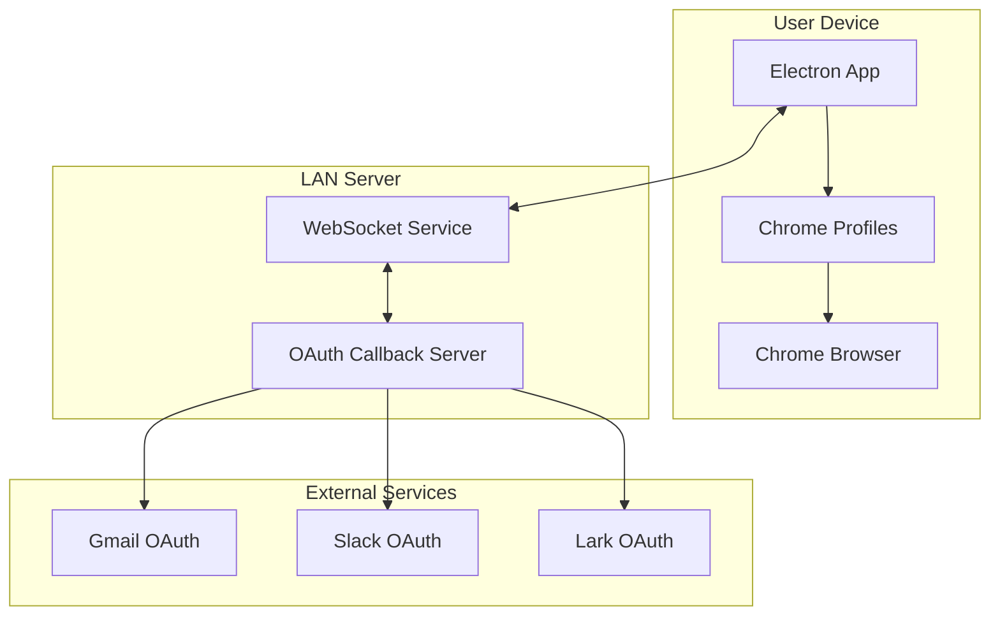

# Cross-Platform Message Search - Architecture Guide

## 🏗️ Overall Architecture

This application adopts a **Remote OAuth Server + Electron Client** architecture, solving the problems of OAuth redirect URI and multi-account Chrome Profile management.



## 🎯 Core Problems Solved

### 1. OAuth Redirect URI Issue
**Problem**: Gmail, Slack, and other OAuth services require a fixed `redirect_uri`, and Electron applications cannot directly receive HTTP callbacks.

**Solution**:
- Deploy an independent OAuth callback server
- Use WebSocket to push authentication results to Electron clients in real-time
- Support multiple Electron clients simultaneously

### 2. Multi-Account Chrome Profile Management
**Problem**: Users have multiple Gmail projects, each with multiple accounts, which need to be opened in corresponding Chrome Profiles.

**Solution**:
- Automatically detect and manage Chrome user profiles
- Create independent Chrome Profiles for each account
- Establish mapping relationships between accounts and Profiles
- Cross-platform support (Windows/macOS/Linux)

## 📋 Complex Account Structure Support

### Project-Account Hierarchy

```
Gmail:
├── Company Project A
│   ├── user1@company-a.com
│   ├── user2@company-a.com
│   └── admin@company-a.com
├── Company Project B
│   ├── user1@company-b.com
│   └── user2@company-b.com
└── Personal Project
    └── personal@gmail.com

Slack:
├── Company A Workspace
│   ├── user@company-a.com
│   └── admin@company-a.com
├── Company B Workspace
│   └── user@company-b.com
└── Personal Workspace
    └── personal@slack.com
```

### Chrome Profile Mapping

Each account corresponds to an independent Chrome Profile:
- `gmail_user1_company-a_com` → Project A User 1
- `gmail_user2_company-a_com` → Project A User 2  
- `slack_user_company-a_com` → Company A Slack
- `gmail_personal_gmail_com` → Personal Gmail

## 🔧 Core Service Components

### 1. IntegratedAuthService (Integrated Authentication Service)
**Responsibilities**: Unified management of OAuth authentication, Chrome Profiles, and account management

**Main Functions**:
- Complete authentication flow management
- Automatic association of accounts and Profiles
- Browser launch management

### 2. AccountManager (Account Manager)
**Responsibilities**: Manage complex project-account structures

**Main Functions**:
- Project creation and management
- Account addition and organization
- Account status management
- Configuration import/export

### 3. ChromeProfileManager (Chrome Profile Manager)
**Responsibilities**: Chrome user profile management

**Main Functions**:
- Automatic Profile detection and creation
- Cross-platform Chrome launching
- Profile lifecycle management

### 4. RemoteOAuthService (Remote OAuth Service)
**Responsibilities**: Communication with OAuth server

**Main Functions**:
- WebSocket connection management
- OAuth flow coordination
- Real-time result reception

## 🚀 Usage Flow

### 1. Start OAuth Server

```bash
cd oauth-server
npm install
npm start
```

The server will start on the LAN IP, e.g., `http://192.168.1.100:3000`

### 2. Configure OAuth Applications

#### Gmail Configuration
1. Google Cloud Console → Create Project
2. Enable Gmail API
3. Create OAuth 2.0 Client
4. Redirect URI: `http://192.168.1.100:3000/oauth/callback/gmail`

#### Slack Configuration
1. Slack API → Create App
2. OAuth & Permissions Configuration
3. Redirect URL: `http://192.168.1.100:3000/oauth/callback/slack`

### 3. Start Electron Application

```bash
npm run dev
```

### 4. Authentication Flow

```typescript
// 1. Create project
const project = await authService.createProject('gmail', 'Company A', 'Company A Gmail Accounts')

// 2. Start authentication
const result = await authService.startAuthFlow({
  platform: 'gmail',
  projectId: project.id,
  accountEmail: 'user1@company-a.com',
  displayName: 'User 1',
  createProfile: true
})

// 3. Open in browser
await authService.openAccountInBrowser(result.account.id, 'https://mail.google.com')
```

## 🔍 Testing and Debugging

### Test OAuth Flow

```bash
# Basic OAuth test
node test-oauth-flow.js

# Full integration test
node test-integrated-auth.js integrated

# Chrome Profile test
node test-integrated-auth.js chrome
```

### Monitor Server Status

```bash
# Health check
curl http://192.168.1.100:3000/health

# Server info
curl http://192.168.1.100:3000/info
```

## 🛡️ Security Considerations

### Development Environment
- HTTP protocol (LAN testing)
- Basic state parameter validation
- Simplified CORS configuration

### Production Environment Recommendations
- HTTPS protocol
- Enhanced state parameter encryption
- Strict CORS configuration
- Client authentication mechanism
- Request rate limiting

## 📊 Data Storage

### Account Configuration Storage
```json
{
  "projects": [
    {
      "id": "proj_123",
      "name": "Company A",
      "platform": "gmail",
      "accounts": [...],
      "createdAt": "2024-01-01T00:00:00.000Z"
    }
  ],
  "accounts": [
    {
      "id": "acc_456", 
      "email": "user1@company-a.com",
      "platform": "gmail",
      "projectId": "proj_123",
      "chromeProfileId": "gmail_user1_company-a_com",
      "tokens": {...}
    }
  ]
}
```

### Chrome Profile Configuration
```json
{
  "profile": {
    "name": "User 1 - Company A",
    "avatar_index": 5
  },
  "account_info": [
    {
      "account_id": "user1@company-a.com",
      "email": "user1@company-a.com", 
      "full_name": "User 1"
    }
  ]
}
```

## 🔄 Extensibility

### Adding New Platforms
1. Add platform configuration in OAuth server
2. Implement platform-specific user info retrieval
3. Update type definitions
4. Add platform-specific URL handling

### Multi-Server Support
- Support multiple OAuth servers
- Load balancing and failover
- Server health checks

### Enterprise Features
- Centralized configuration management
- User permission control
- Audit logging
- Bulk account import

## 🐛 Troubleshooting

### Common Issues

1. **OAuth Callback Failed**
   - Check redirect URI configuration
   - Verify server accessibility
   - Validate client ID and secret

2. **Chrome Profile Creation Failed**
   - Check Chrome installation path
   - Verify user data directory permissions
   - Validate Profile name format

3. **WebSocket Connection Failed**
   - Check network connection
   - Verify firewall settings
   - Validate server address

### Debugging Tips

1. **Enable Verbose Logging**
   ```typescript
   const authService = new IntegratedAuthService(serverUrl)
   authService.on('*', console.log) // Listen to all events
   ```

2. **Check Profile Status**
   ```typescript
   const profiles = await profileManager.listProfiles()
   console.log('All Profiles:', profiles)
   ```

3. **Monitor Server Status**
   ```bash
   watch -n 5 'curl -s http://192.168.1.100:3000/health | jq'
   ```

## 📚 API Reference

### IntegratedAuthService

```typescript
// Start authentication flow
startAuthFlow(options: AuthFlowOptions): Promise<AuthResult>

// Open account in browser
openAccountInBrowser(accountId: string, url: string): Promise<void>

// Create project
createProject(platform: string, name: string, description?: string): Promise<Project>

// Get account groups
getAccountGroups(): AccountGroup[]
```

### AccountManager

```typescript
// Add account to project
addAccountToProject(projectId: string, email: string, displayName?: string): Promise<Account>

// Link Chrome Profile
linkChromeProfile(accountId: string, chromeProfileId: string): Promise<void>

// Update account tokens
updateAccountTokens(accountId: string, tokens: TokenInfo): Promise<void>
```

### ChromeProfileManager

```typescript
// Get or create Profile
getOrCreateProfile(platform: string, email: string, displayName?: string): Promise<ChromeProfile>

// Open Chrome with specific Profile
openChromeWithProfile(profileId: string, url: string): Promise<void>

// List all Profiles
listProfiles(): Promise<ChromeProfile[]>
```

This architecture provides a complete solution for complex multi-account, multi-platform message search applications, supporting flexible extensions and enterprise-level usage scenarios.